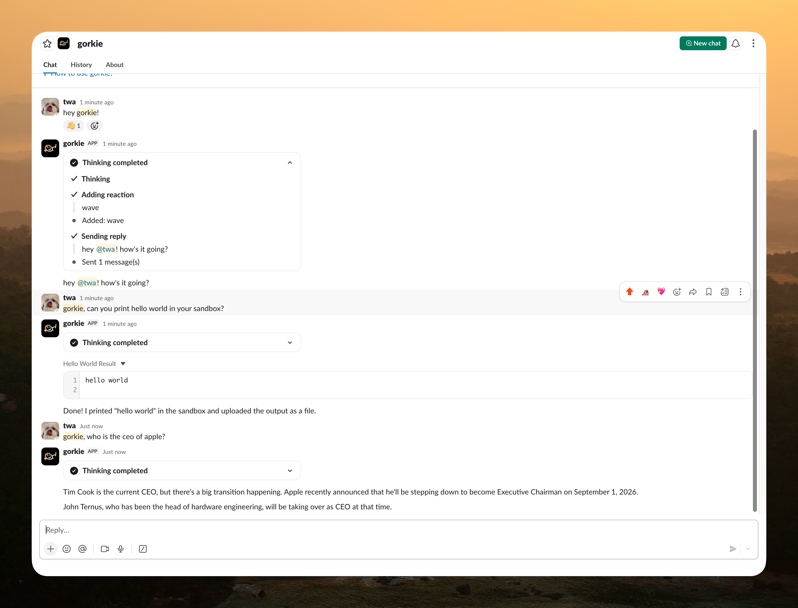

<div align="center">
  
  <h1>gorkie</h1>
  <p>An AI assistant for Slack, built on Mastra.</p>
</div>

## Table of Contents

1. [Introduction](#introduction)
2. [Features](#features)
3. [Tech Stack](#tech-stack)
4. [Getting Started](#getting-started)
5. [Environment](#environment)
6. [Project Structure](#project-structure)
7. [Development](#development)
8. [License](#license)

## Introduction

gorkie is an AI assistant for Slack. It replies to mentions, DMs, and subscribed
threads with answers backed by sandboxed code execution and a broad tool set,
and can also run recurring scheduled tasks and one-time reminders on its own.

The bot runs as a long-lived Bun process. Slack events are handled through
[Mastra][mastra]'s built-in [channels][channels] feature, which wires the
[Vercel Chat SDK][chat-sdk] Slack adapter in **Socket Mode**, while the agent
runs through Mastra's native runtime. Each Slack thread gets its own isolated
[E2B][e2b] sandbox so gorkie can run commands and inspect files without ever
touching the host machine.

## Features

- Slack-native replies for mentions, DMs, and subscribed thread follow-ups;
  `##` ignore for messages that shouldn't get a reply. When gorkie is pinged
  again in the middle of a thread it is not actively following, it forces a
  fresh thread-history backfill so it sees the recent conversation before
  answering.
- Real-time streaming responses with live tool-activity widgets (grouped/
  timeline task cards) in Slack.
- Per-thread [E2B][e2b] sandbox sessions: isolated cloud VMs, never the host.
  Full filesystem access (`read_file`/`write_file`/`edit_file`/`list_files`/
  `delete_file`/`file_stat`/`ast_edit`) plus shell command execution
  (`execute_command`) with background process support (`get_process_output`,
  `kill_process`).
- Delegated helper agents for research (Slack/web lookups) and codebase
  exploration (read-only workspace inspection), so heavy multi-step digging
  doesn't clutter the main conversation.
- Web search and page fetching via [Exa][exa], plus Slack search across
  channels, threads, users, and past messages.
- Slack-native tools: read/summarize conversation history, list threads,
  inspect channels and users, post to another thread/channel/DM, upload and
  download files, leave a thread or channel.
- Recurring scheduled tasks (cron-based, create/list/pause/resume/delete) and
  one-time reminders, both delivered back into the Slack conversation where
  they were scheduled.
- AI image generation, deliverable back to Slack via file upload.
- [Observational Memory][om]: long conversations are compressed into a dense
  observation log instead of carrying full raw history.
- Mastra Platform tracing with sensitive-data redaction.

See [TODO.md](./TODO.md) for the current roadmap and known open issues.

## Tech Stack

- [Bun][bun] and TypeScript
- [Mastra][mastra], agent runtime + [channels][channels]
- [Vercel Chat SDK][chat-sdk] with `@chat-adapter/slack` (via Mastra channels)
- Model routing across multiple OpenRouter-compatible gateways (the
  [Hack Club][hackclub] proxy, opencode.ai, and real [OpenRouter][openrouter])
  with automatic per-gateway fallback
- [E2B][e2b] sandbox sessions
- [Exa][exa] for web search and page fetching
- [PostgreSQL][postgres] via `@mastra/pg` for Mastra memory and channel state
- Mastra Observability exported to Mastra Platform
- [Pino][pino] logging

## Getting Started

Create a new [Slack app](https://api.slack.com/apps) **from a manifest** using
[`slack-manifest.yaml`](./slack-manifest.yaml) (enables Socket Mode, the
Assistant view, scopes, and event subscriptions). You will also need
[Bun][bun], a [PostgreSQL][postgres] connection string, an [E2B][e2b] API key,
an [Exa][exa] API key, a Mastra Platform project, and a model key
([Hack Club][hackclub] or [OpenRouter][openrouter]).

```bash
# Clone this repository
git clone https://github.com/techwithanirudh/gorkie.git

# Install dependencies
bun install

# Copy and fill in the environment
cp .env.example .env

# Run the bot locally (also serves Mastra Studio at http://localhost:4111)
bun run dev
```

Local development uses Slack Socket Mode, so the bot does not need a public HTTP
tunnel to receive Slack events. You should see `[gorkie] online` once connected.

For a production-style run: `bun run build` then `bun run start`.

### Database

Set `DATABASE_URL` to a Postgres database reachable by the host process. Mastra
auto-creates its own tables for memory and channel state on first run. App data
that is not owned by Mastra should use its own schema or clearly named tables in
the same database.

Local Postgres works fine, but the repo no longer assumes a specific local
cluster, port, database, or role. Use whatever local or hosted Postgres instance
you normally develop against and put that connection string in `.env`.

### Observability

Gorkie exports traces to Mastra Platform with `MastraPlatformExporter` in
`src/mastra/index.ts`. Use two Mastra Platform projects: one for development and
one for production.

Keep the code and variable names the same in both environments:

- Local/dev `.env`: `MASTRA_PROJECT_ID` points at the dev project.
- Production secrets: `MASTRA_PROJECT_ID` points at the prod project.
- `MASTRA_PLATFORM_ACCESS_TOKEN` must be a token that can write to the selected
  project.

This keeps dev traces, experiments, and debugging noise out of the production
observability project without adding runtime branching. If dev and prod should
also have separate memory/channel state, give each environment a different
`DATABASE_URL` too.

## Environment

| Variable | Required | Description |
|---|---|---|
| `SLACK_BOT_TOKEN` | yes | Bot User OAuth token (`xoxb-…`) |
| `SLACK_APP_TOKEN` | yes | App-level token with `connections:write` (`xapp-…`) |
| `OPT_IN_CHANNEL` | no | Slack channel id gating access to members only (opt-in allowlist); unset means everyone is allowed |
| `HACKCLUB_API_KEY` | yes | Hack Club AI proxy key (`sk-hc-…`), a gateway rung for every model |
| `OPENROUTER_API_KEY` | no | Real OpenRouter key (`sk-or-v1-…`), used as a fallback gateway |
| `OPENROUTER_BASE_URL` | no | Defaults to real OpenRouter; override to point elsewhere |
| `OPENCODE_API_KEY` | no | opencode.ai/zen gateway key, tried before the OpenRouter rungs |
| `DATABASE_URL` | yes | Postgres connection string for Mastra memory and channel state |
| `E2B_API_KEY` | yes | E2B sandbox key (`e2b_…`) |
| `EXA_API_KEY` | yes | Exa key, powers `search_web`/`fetch_url` |
| `AGENTMAIL_API_KEY` | no | Broker AgentMail API access into sandbox egress for `gorkie@agentmail.to` |
| `GITHUB_TOKEN` | no | Broker GitHub API access into sandbox egress for the `gorkie-agent` account |
| `MASTRA_PLATFORM_ACCESS_TOKEN` | yes | Mastra Platform access token for tracing/observability |
| `MASTRA_PROJECT_ID` | yes | Mastra Platform project id |

## Project Structure

```text
src/
  env.ts                        Zod-validated environment
  mastra/
    index.ts                    Mastra instance: Postgres, Platform tracing, logger, agents
    config.ts                   Sandbox, agent, scheduled-task, and tool-display config
    providers.ts                Model gateway definitions (orchestrator, summarizer, scout, explorer)
    agents/gorkie.ts             The agent: model, instructions, memory, tools, channels
    agents/research.ts           Delegated Slack/web research helper agent
    agents/explore.ts            Delegated read-only codebase exploration helper agent
    chat/                        Chat SDK client, handlers, tool display, App Home extras
    workspace/                   E2B sandbox workspace (per-thread, isolated)
    tools/                       Tool registry: Slack, scheduled tasks, sandbox, web, media
    processors/                  Input/output processors (turn logging, media relocation, etc.)
    mcp/                         MCPClient scaffold for connecting external MCP servers (empty for now)
```

Constructing the Mastra instance registers the agent, which starts the Slack
Socket Mode connection. See [DESIGN.md](./DESIGN.md) for the full architecture
and the reasoning behind using Mastra channels.

## Development

```bash
bun run dev          # Mastra Studio + the live bot at http://localhost:4111
bun run build        # Build for production
bun run start        # Run the built output (production-style)
bun run typecheck    # tsc --noEmit
bun run check        # Lint (ultracite/Biome)
```

## License

[AGPL-3.0-only](./LICENSE).

[bun]: https://bun.sh/
[mastra]: https://mastra.ai/
[channels]: https://mastra.ai/docs/agents/channels
[chat-sdk]: https://chat-sdk.dev/
[openrouter]: https://openrouter.ai/
[hackclub]: https://ai.hackclub.com/
[e2b]: https://e2b.dev/
[exa]: https://exa.ai/
[postgres]: https://www.postgresql.org/
[om]: https://mastra.ai/docs/memory/observational-memory
[pino]: https://getpino.io/
